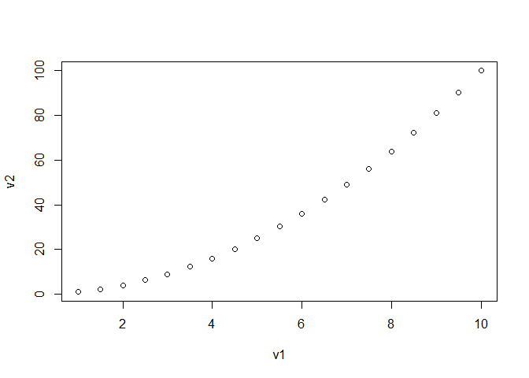
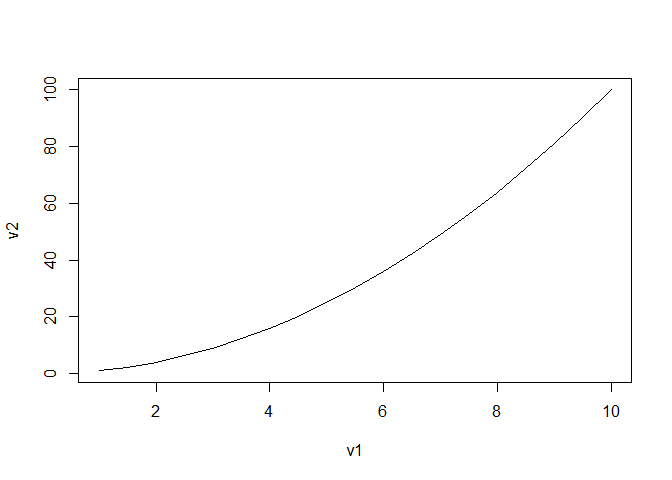
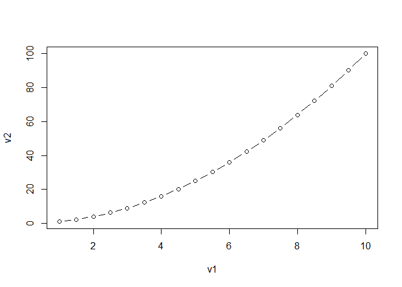
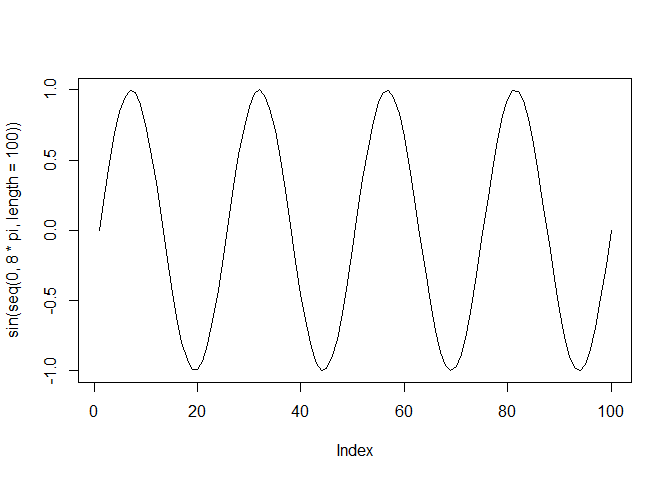
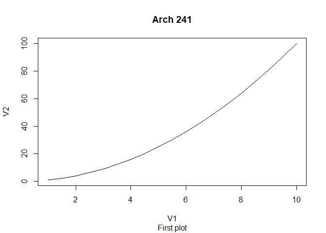

Arch 241 examples
================
Dana
September 27, 2018

Introduction
============

Here is a "chunk" of R code. You can execute it one line at a time, or all at once.

``` r
  x<-9 
  sqrt(x)
```

    ## [1] 3

``` r
  log(x)  # You can write notes
```

    ## [1] 2.197225

You can also write text between your chunks of code

First operations in R
=====================

Creating a list and selecting elements from a list
--------------------------------------------------

``` r
  x <- c(3,-2,4,2,0,6)
  x
```

    ## [1]  3 -2  4  2  0  6

``` r
  x[3]
```

    ## [1] 4

``` r
  x[1:3]
```

    ## [1]  3 -2  4

``` r
  mean(x)
```

    ## [1] 2.166667

``` r
  sum(x)
```

    ## [1] 13

``` r
  max(x)
```

    ## [1] 6

``` r
  z <- x > 2; z
```

    ## [1]  TRUE FALSE  TRUE FALSE FALSE  TRUE

Assigning some more variables
-----------------------------

``` r
  v1 = seq(1,10, by=0.5) #Variables are case sensitive
  V1 = 'Ciao'
  v1;V1
```

    ##  [1]  1.0  1.5  2.0  2.5  3.0  3.5  4.0  4.5  5.0  5.5  6.0  6.5  7.0  7.5
    ## [15]  8.0  8.5  9.0  9.5 10.0

    ## [1] "Ciao"

``` r
  sd(v1)
```

    ## [1] 2.813657

``` r
  v2  <-v1^2
  v3 <- v1[v1>5];v3
```

    ##  [1]  5.5  6.0  6.5  7.0  7.5  8.0  8.5  9.0  9.5 10.0

Making basic plots with base r
------------------------------

``` r
  plot(v1,v2, type='p')
```



``` r
  help(plot)
```

    ## starting httpd help server ... done

``` r
  plot(v1,v2, type='l')
```



``` r
  plot(v1,v2, type='b')
```



``` r
plot(sin(seq(0,8*pi,length=100)),type='l')
```



``` r
summary(v1)
```

    ##    Min. 1st Qu.  Median    Mean 3rd Qu.    Max. 
    ##    1.00    3.25    5.50    5.50    7.75   10.00

``` r
plot(v1,v2, type='l',ylab='V2', xlab='V1',main='Arch 241', sub='First plot')
```



Running a linear model on the two plotted variables
---------------------------------------------------

``` r
  cor(v1,v2)
```

    ## [1] 0.9762844

``` r
  LinearModel<-lm(v2~v1); summary(LinearModel)
```

    ## 
    ## Call:
    ## lm(formula = v2 ~ v1)
    ## 
    ## Residuals:
    ##    Min     1Q Median     3Q    Max 
    ## -7.500 -5.875 -1.250  4.750 12.750 
    ## 
    ## Coefficients:
    ##             Estimate Std. Error t value Pr(>|t|)    
    ## (Intercept) -22.7500     3.6349  -6.259 8.65e-06 ***
    ## v1           11.0000     0.5916  18.593 9.82e-13 ***
    ## ---
    ## Signif. codes:  0 '***' 0.001 '**' 0.01 '*' 0.05 '.' 0.1 ' ' 1
    ## 
    ## Residual standard error: 7.062 on 17 degrees of freedom
    ## Multiple R-squared:  0.9531, Adjusted R-squared:  0.9504 
    ## F-statistic: 345.7 on 1 and 17 DF,  p-value: 9.821e-13

Working with thermal comfort data
=================================

### load some helpful packages

``` r
library(tidyverse)
```

    ## Warning: package 'tidyverse' was built under R version 3.5.1

    ## -- Attaching packages -------------------------------------------------------------------- tidyverse 1.2.1 --

    ## v ggplot2 2.2.1     v purrr   0.2.4
    ## v tibble  1.4.2     v dplyr   0.7.4
    ## v tidyr   0.8.0     v stringr 1.3.0
    ## v readr   1.1.1     v forcats 0.3.0

    ## -- Conflicts ----------------------------------------------------------------------- tidyverse_conflicts() --
    ## x dplyr::filter() masks stats::filter()
    ## x dplyr::lag()    masks stats::lag()

``` r
library(here)
```

    ## here() starts at C:/Users/Dana/3_Professional/CBE/Reproducibility/arch241_examples

``` r
library(skimr) # a summary function
```

    ## Warning: package 'skimr' was built under R version 3.5.1

    ## 
    ## Attaching package: 'skimr'

    ## The following objects are masked from 'package:dplyr':
    ## 
    ##     contains, ends_with, everything, matches, num_range, one_of,
    ##     starts_with

### Load file

``` r
Arch241simple <- read_csv(here("example_data.csv"))
```

    ## Parsed with column specification:
    ## cols(
    ##   Top = col_character(),
    ##   RH = col_integer(),
    ##   Sex = col_character(),
    ##   Subject = col_integer(),
    ##   TS = col_double(),
    ##   TC = col_double(),
    ##   TA = col_double(),
    ##   PMV = col_double(),
    ##   PPD = col_integer(),
    ##   Experiment = col_character()
    ## )

    ## Warning: 2 parsing failures.
    ## row # A tibble: 2 x 5 col     row col   expected   actual        file                                expected   <int> <chr> <chr>      <chr>         <chr>                               actual 1   211 Top   ""         embedded null 'C:/Users/Dana/3_Professional/CBE/~ file 2   211 <NA>  10 columns 1 columns     'C:/Users/Dana/3_Professional/CBE/~

``` r
Arch241simple
```

    ## # A tibble: 211 x 10
    ##    Top      RH Sex   Subject    TS    TC     TA   PMV   PPD Experiment
    ##    <chr> <int> <chr>   <int> <dbl> <dbl>  <dbl> <dbl> <int> <chr>     
    ##  1 20       50 F           1 -1.32  1.73  0.31   -1.9    78 A         
    ##  2 20       50 F           2 -0.79  2.19  0.54   -1.9    78 A         
    ##  3 20       50 F           3 -2.82  3.73 -0.84   -1.9    78 A         
    ##  4 20       50 F           4 -2.55  3.41 -0.71   -1.9    78 A         
    ##  5 20       50 F           5 -1.26  3.11 -0.4    -1.9    78 A         
    ##  6 20       50 F           6 -1.94  2.54 -0.3    -1.9    78 A         
    ##  7 20       50 F           7 -2.16  3.09 -0.290  -1.9    78 A         
    ##  8 20       50 F           8 -3.44  3.49 -0.76   -1.9    78 A         
    ##  9 20       50 F           9 -2.35  2     0.24   -1.9    78 A         
    ## 10 20       50 F          10 -1.9   3.49 -0.88   -1.9    78 A         
    ## # ... with 201 more rows

### summary

``` r
# 
Arch241simple[1:30,] # the first 30 columns
```

    ## # A tibble: 30 x 10
    ##    Top      RH Sex   Subject    TS    TC     TA   PMV   PPD Experiment
    ##    <chr> <int> <chr>   <int> <dbl> <dbl>  <dbl> <dbl> <int> <chr>     
    ##  1 20       50 F           1 -1.32  1.73  0.31   -1.9    78 A         
    ##  2 20       50 F           2 -0.79  2.19  0.54   -1.9    78 A         
    ##  3 20       50 F           3 -2.82  3.73 -0.84   -1.9    78 A         
    ##  4 20       50 F           4 -2.55  3.41 -0.71   -1.9    78 A         
    ##  5 20       50 F           5 -1.26  3.11 -0.4    -1.9    78 A         
    ##  6 20       50 F           6 -1.94  2.54 -0.3    -1.9    78 A         
    ##  7 20       50 F           7 -2.16  3.09 -0.290  -1.9    78 A         
    ##  8 20       50 F           8 -3.44  3.49 -0.76   -1.9    78 A         
    ##  9 20       50 F           9 -2.35  2     0.24   -1.9    78 A         
    ## 10 20       50 F          10 -1.9   3.49 -0.88   -1.9    78 A         
    ## # ... with 20 more rows

``` r
summary(Arch241simple) #stat summary
```

    ##      Top                  RH            Sex               Subject    
    ##  Length:211         Min.   :50.00   Length:211         Min.   : 1.0  
    ##  Class :character   1st Qu.:50.00   Class :character   1st Qu.: 8.0  
    ##  Mode  :character   Median :50.00   Mode  :character   Median :15.5  
    ##                     Mean   :55.71                      Mean   :15.5  
    ##                     3rd Qu.:70.00                      3rd Qu.:23.0  
    ##                     Max.   :70.00                      Max.   :30.0  
    ##                     NA's   :1                          NA's   :1     
    ##        TS                TC              TA               PMV      
    ##  Min.   :-3.4400   Min.   :0.310   Min.   :-0.8800   Min.   :-1.9  
    ##  1st Qu.:-0.6325   1st Qu.:1.587   1st Qu.:-0.0800   1st Qu.:-0.9  
    ##  Median : 0.1500   Median :1.935   Median : 0.2350   Median : 1.2  
    ##  Mean   : 0.1781   Mean   :2.064   Mean   : 0.2268   Mean   : 0.7  
    ##  3rd Qu.: 1.1375   3rd Qu.:2.442   3rd Qu.: 0.6475   3rd Qu.: 2.3  
    ##  Max.   : 3.6600   Max.   :3.730   Max.   : 0.9800   Max.   : 2.6  
    ##  NA's   :1         NA's   :1       NA's   :1         NA's   :1     
    ##       PPD         Experiment       
    ##  Min.   : 5.00   Length:211        
    ##  1st Qu.:24.00   Class :character  
    ##  Median :45.00   Mode  :character  
    ##  Mean   :52.71                     
    ##  3rd Qu.:88.00                     
    ##  Max.   :94.00                     
    ##  NA's   :1

``` r
skim(Arch241simple)
```

    ## Skim summary statistics
    ##  n obs: 211 
    ##  n variables: 10 
    ## 
    ## -- Variable type:character ----------------------------------------------------------------------------------
    ##    variable missing complete   n min max empty n_unique
    ##  Experiment       1      210 211   1   1     0        7
    ##         Sex       1      210 211   1   1     0        2
    ##         Top       0      211 211   2   6     0        6
    ## 
    ## -- Variable type:integer ------------------------------------------------------------------------------------
    ##  variable missing complete   n  mean    sd p0 p25  p50 p75 p100     hist
    ##       PPD       1      210 211 52.71 31.84  5  24 45    88   94 <U+2583><U+2583><U+2583><U+2583><U+2581><U+2581><U+2583><U+2587>
    ##        RH       1      210 211 55.71  9.06 50  50 50    70   70 <U+2587><U+2581><U+2581><U+2581><U+2581><U+2581><U+2581><U+2583>
    ##   Subject       1      210 211 15.5   8.68  1   8 15.5  23   30 <U+2587><U+2587><U+2586><U+2587><U+2587><U+2586><U+2587><U+2587>
    ## 
    ## -- Variable type:numeric ------------------------------------------------------------------------------------
    ##  variable missing complete   n mean   sd    p0   p25  p50  p75 p100
    ##       PMV       1      210 211 0.7  1.54 -1.9  -0.9  1.2  2.3  2.6 
    ##        TA       1      210 211 0.23 0.47 -0.88 -0.08 0.23 0.65 0.98
    ##        TC       1      210 211 2.06 0.67  0.31  1.59 1.94 2.44 3.73
    ##        TS       1      210 211 0.18 1.38 -3.44 -0.63 0.15 1.14 3.66
    ##      hist
    ##  <U+2583><U+2583><U+2581><U+2583><U+2581><U+2587><U+2581><U+2587>
    ##  <U+2582><U+2582><U+2583><U+2586><U+2587><U+2585><U+2587><U+2586>
    ##  <U+2581><U+2582><U+2585><U+2587><U+2585><U+2582><U+2582><U+2582>
    ##  <U+2581><U+2582><U+2585><U+2587><U+2587><U+2585><U+2582><U+2581>

``` r
#summary(Arch241simple$Top) # not working as expected

names(Arch241simple) #variable names
```

    ##  [1] "Top"        "RH"         "Sex"        "Subject"    "TS"        
    ##  [6] "TC"         "TA"         "PMV"        "PPD"        "Experiment"

### Subsetting

``` r
#tidyverse style
Arch241simpleMale <- Arch241simple %>%
    filter(Sex=="M")

summary(Arch241simpleMale) 
```

    ##      Top                  RH            Sex               Subject  
    ##  Length:105         Min.   :50.00   Length:105         Min.   :16  
    ##  Class :character   1st Qu.:50.00   Class :character   1st Qu.:19  
    ##  Mode  :character   Median :50.00   Mode  :character   Median :23  
    ##                     Mean   :55.71                      Mean   :23  
    ##                     3rd Qu.:70.00                      3rd Qu.:27  
    ##                     Max.   :70.00                      Max.   :30  
    ##        TS                TC              TA               PMV      
    ##  Min.   :-3.2500   Min.   :0.900   Min.   :-0.7500   Min.   :-1.9  
    ##  1st Qu.:-0.5200   1st Qu.:1.610   1st Qu.:-0.0400   1st Qu.:-0.9  
    ##  Median : 0.2500   Median :1.900   Median : 0.2500   Median : 1.2  
    ##  Mean   : 0.2927   Mean   :2.015   Mean   : 0.2558   Mean   : 0.7  
    ##  3rd Qu.: 1.2300   3rd Qu.:2.320   3rd Qu.: 0.6600   3rd Qu.: 2.3  
    ##  Max.   : 3.2900   Max.   :3.650   Max.   : 0.9600   Max.   : 2.6  
    ##       PPD         Experiment       
    ##  Min.   : 5.00   Length:105        
    ##  1st Qu.:24.00   Class :character  
    ##  Median :45.00   Mode  :character  
    ##  Mean   :52.71                     
    ##  3rd Qu.:88.00                     
    ##  Max.   :94.00

``` r
#Older base R style
#Arch241simpleMale <- subset(Arch241simple, #Gender=="Male");summary(Arch241simpleMale) #subset
```
